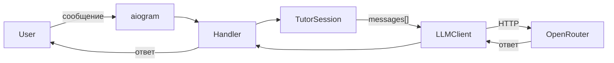

# MVP Telegram-бот: план реализации

## Создаваемые файлы

```
olich_tutor/
├── bot/
│   ├── __init__.py
│   └── handlers/
│       ├── __init__.py
│       └── messages.py      # /start + текстовые сообщения
├── llm/
│   ├── __init__.py
│   └── client.py            # LLMClient
├── tutor/
│   ├── __init__.py
│   └── session.py           # TutorSession + sessions dict
├── config.py                # Settings (pydantic-settings)
├── main.py                  # polling + logging
├── requirements.txt
├── Makefile
├── .env.example
└── .gitignore
```

## Ключевые решения

### `requirements.txt`
```
aiogram>=3.15
openai>=1.70
pydantic-settings>=2.8
python-dotenv>=1.1
```

### `config.py` — `Settings`
```python
class Settings(BaseSettings):
    telegram_token: str
    openrouter_api_key: str
    openrouter_base_url: str = "https://openrouter.ai/api/v1"
    llm_model: str = "openai/gpt-4o-mini"
    log_level: str = "INFO"

    model_config = SettingsConfigDict(env_file=".env")
```

### `llm/client.py` — `LLMClient`
```python
class LLMClient:
    def __init__(self, api_key, base_url, model): ...
    def chat(self, messages: list[dict]) -> str: ...
```
Stateless: принимает готовый `messages[]`, возвращает строку.

### `tutor/session.py` — `TutorSession`
```python
@dataclass
class TutorSession:
    user_id: int
    level: str = "unknown"
    topic: str = ""
    history: list[dict] = field(default_factory=list)
    progress: list[str] = field(default_factory=list)

sessions: dict[int, TutorSession] = {}
```
Системный промпт добавляется в `history` при создании сессии.

### `bot/handlers/messages.py`
- `/start` — создаёт сессию, приветствие
- текстовые сообщения — добавляют в историю, вызывают `LLMClient.chat()`, возвращают ответ

### Системный промпт (заглушка)
```
Ты — AI-репетитор по математике. Объясняй понятно, адаптируй стиль под уровень ученика.
```

### `main.py`
- Настройка `logging` (формат из vision.md, уровень из `Settings`)
- Инициализация `Bot`, `Dispatcher`, `LLMClient`
- Регистрация роутера из `bot/handlers/`
- `asyncio.run(dp.start_polling(bot))`

### `Makefile`
```makefile
install:
    python -m venv .venv
    .venv\Scripts\uv pip install -r requirements.txt

run:
    .venv\Scripts\python main.py

lint:
    .venv\Scripts\ruff check .

format:
    .venv\Scripts\ruff format .
```

## Поток данных


