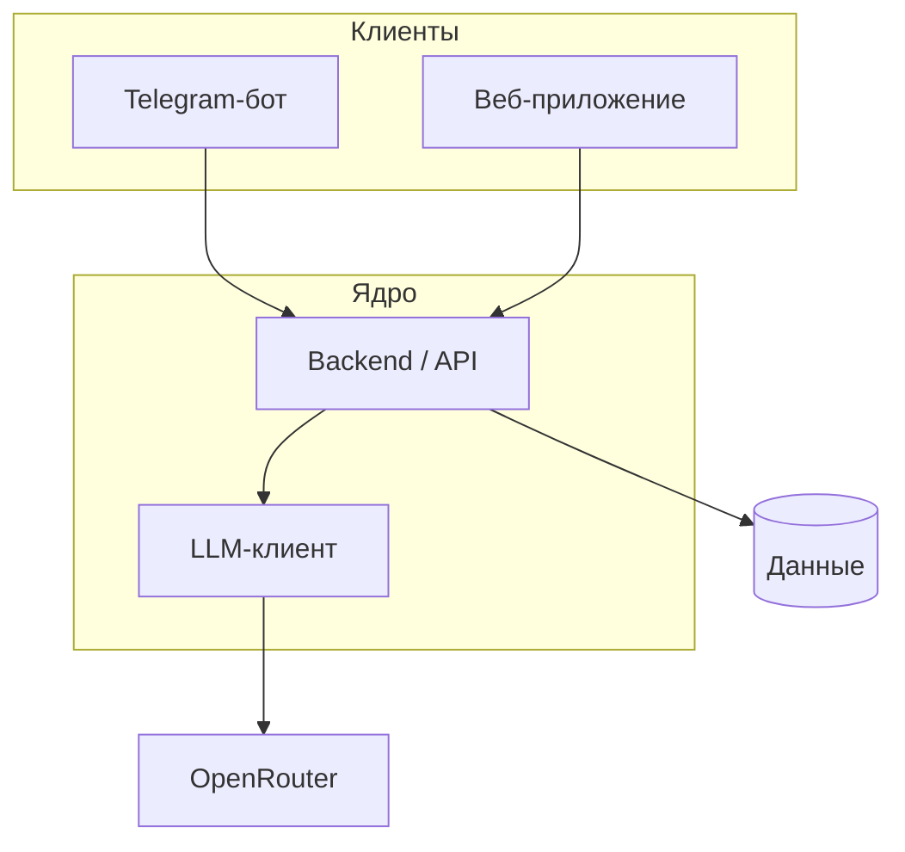

# olich_tutor

Персональный AI-репетитор и сопровождение учебного процесса для школьников и взрослых; основной канал входа — Telegram-бот.

## О проекте

Обучение с репетитором часто непрозрачно: прогресс не фиксируется, родителю сложно видеть результат. Система даёт объяснения, задания и обратную связь через бота (далее — веб), централизуя логику в backend. Ключевые пользователи: ученик и родитель; роль преподавателя — в перспективе.

## Архитектура

## Статус

| Этап | Название | Статус |
|------|----------|--------|
| 1 | Фундамент и Telegram-клиент | ✅ |
| 2 | MVP-учебные сценарии в боте | 🚧 |
| 3 | Персистентность и модель данных | 📋 |
| 4 | Веб-клиент ученика и родителя | 📋 |
| 5 | Расширение платформы | 📋 |
| 6 | Продакшн и сопровождение | 📋 |

Подробности этапов и критерии — в [docs/plan.md](docs/plan.md).

## Документация

- [Идея продукта](docs/idea.md)
- [Архитектурное видение](docs/vision.md)
- [Модель данных](docs/data-model.md)
- [Интеграции](docs/integrations.md)
- [План](docs/plan.md)
- [Задачи](docs/tasks/)

## Быстрый старт

1. **Зависимости:** `make install` (venv и пакеты из `requirements.txt`).

2. **Конфигурация:** скопируйте `.env.example` в `.env` и заполните переменные (в файле — комментарии, какая группа для бота, какая для backend).

### Telegram-бот

Нужны `TELEGRAM_TOKEN` и доступный backend: в `.env` задайте `BACKEND_BASE_URL` (по умолчанию `http://127.0.0.1:8000`). Рабочий диалог с LLM: сначала запустите **`make run-backend`**, затем в другом терминале **`make run`** (корневой `main.py`). Ключ `OPENROUTER_API_KEY` указывается для процесса API, не для бота. Подробнее — [docs/vision.md](docs/vision.md).

### Backend API

Отдельный процесс HTTP API (ядро; Telegram-бот ходит сюда по HTTP).

- **Запуск:** `make run-backend` (эквивалент `python -m backend` — Uvicorn, хост и порт из `BACKEND_HOST` / `BACKEND_PORT` в `.env`).
- **Базовый URL:** `http://<BACKEND_HOST>:<BACKEND_PORT>` (по умолчанию `http://127.0.0.1:8000`, если слушаете на `0.0.0.0`).
- **Проверка живости:** `GET /health` или `GET /ready` (например `curl http://127.0.0.1:8000/health`).
- **Документация API:** интерактивно — **Swagger UI** по пути `/docs`; схема OpenAPI в JSON — `/openapi.json`. Зафиксированная копия контракта в репозитории: [`backend/openapi.yaml`](backend/openapi.yaml).
- **Минимум переменных для процесса API:** `TELEGRAM_TOKEN` не требуется. Для сценариев с реальным LLM задайте `OPENROUTER_API_KEY` (и при необходимости `OPENROUTER_BASE_URL`, `LLM_MODEL`).

### Команды `make`

| Команда | Назначение |
|--------|------------|
| `make install` | venv и зависимости |
| `make run` | Telegram-бот |
| `make run-backend` | HTTP API (backend) |
| `make test` | pytest (в т.ч. тесты API) |
| `make lint` | ruff check |
| `make format` | ruff format |
| `make check` | линт и тесты подряд (удобно перед коммитом) |

Полный перечень переменных окружения — в `.env.example` и в [docs/vision.md](docs/vision.md).
