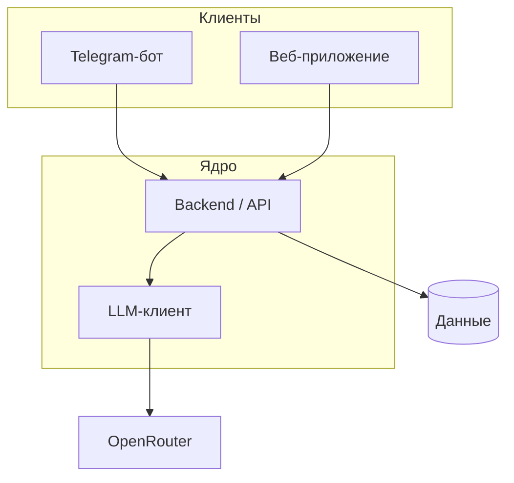

# olich_tutor

Персональный AI-репетитор и сопровождение учебного процесса для школьников и взрослых; основной канал входа — Telegram-бот.

## О проекте

Обучение с репетитором часто непрозрачно: прогресс не фиксируется, родителю сложно видеть результат. Система даёт объяснения, задания и обратную связь через бота (далее — веб), централизуя логику в backend. Ключевые пользователи: ученик и родитель; роль преподавателя — в перспективе.

## Архитектура

## Статус

| Этап | Название | Статус |
|------|----------|--------|
| 1 | Фундамент и Telegram-клиент | ✅ |
| 2 | MVP-учебные сценарии в боте | 📋 |
| 3 | Персистентность и модель данных | 📋 |
| 4 | Веб-клиент ученика и родителя | 📋 |
| 5 | Расширение платформы | 📋 |
| 6 | Продакшн и сопровождение | 📋 |

Подробности этапов и критерии — в [docs/plan.md](docs/plan.md).

## Документация

- [Идея продукта](docs/idea.md)
- [Архитектурное видение](docs/vision.md)
- [Модель данных](docs/data-model.md)
- [Интеграции](docs/integrations.md)
- [План](docs/plan.md)
- [Задачи](docs/tasks/)

## Быстрый старт

Скопируйте `.env.example` в `.env`, задайте `TELEGRAM_TOKEN` и `OPENROUTER_API_KEY` (см. [docs/vision.md](docs/vision.md)). Затем: `make install`, `make run`. Остальные цели `make` и стек описаны в vision.
