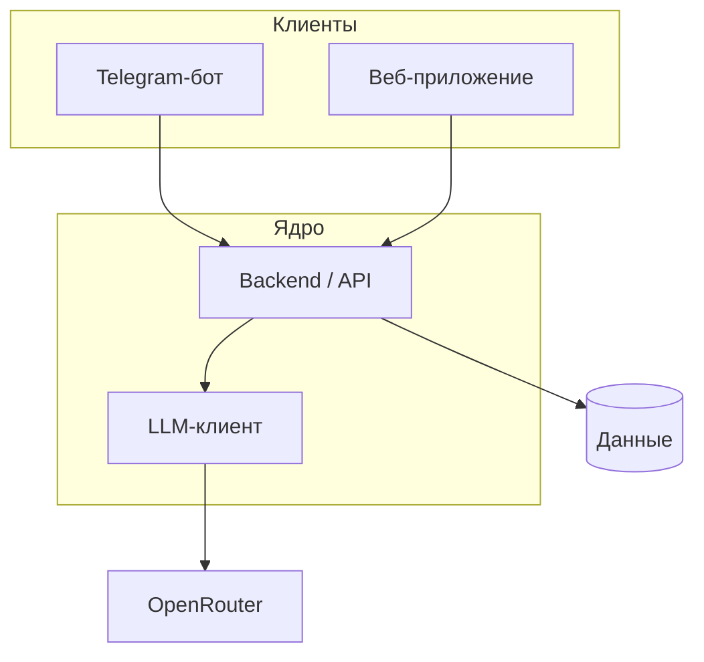

# olich_tutor

Персональный AI-репетитор и сопровождение учебного процесса для школьников и взрослых; основной канал входа — Telegram-бот.

## О проекте

Обучение с репетитором часто непрозрачно: прогресс не фиксируется, родителю сложно видеть результат. Система даёт объяснения, задания и обратную связь через бота (далее — веб), централизуя логику в backend. Ключевые пользователи: ученик и родитель; роль преподавателя — в перспективе.

## Архитектура

## Статус

| Этап | Название | Статус |
|------|----------|--------|
| 1 | Фундамент и Telegram-клиент | ✅ |
| 2 | MVP-учебные сценарии в боте | ✅ |
| 3 | Персистентность и модель данных | ✅ |
| 4 | Веб-клиент ученика и родителя | 🚧 |
| 5 | Расширение платформы | 📋 |
| 6 | Продакшн и сопровождение | 📋 |

Подробности этапов и критерии — в [docs/plan.md](docs/plan.md).

## Деплой на VPS

Пошаговая инструкция (PostgreSQL в Docker на localhost, systemd для API и бота, шаблоны `.env`): **[deploy/README.md](deploy/README.md)**. Автодеплой по push в `main`/`master` через GitHub Actions — раздел **CI/CD** в том же файле и job `deploy` в [`.github/workflows/ci.yml`](.github/workflows/ci.yml).

## Документация

- [Идея продукта](docs/idea.md)
- [Архитектурное видение](docs/vision.md)
- [Модель данных](docs/data-model.md)
- [Интеграции](docs/integrations.md)
- [План](docs/plan.md)
- [Задачи](docs/tasks/)

## Быстрый старт

1. **Зависимости:** `make install` (venv и пакеты из `requirements.txt`).

2. **Конфигурация:** скопируйте `.env.example` в `.env` и заполните переменные (в файле — комментарии, какая группа для бота, какая для backend).

### PostgreSQL (локально)

Нужен [Docker](https://docs.docker.com/get-docker/) с Docker Compose.

1. `make db-up` — контейнер PostgreSQL (на хосте порт **`5433`** → 5432 в контейнере; креды в [`docker-compose.yml`](docker-compose.yml) и `.env.example`). Если порт свободен, при желании можно сменить маппинг в compose на `5432:5432`.
2. Убедитесь, что в `.env` задан `DATABASE_URL` (пример — в `.env.example`).
3. `make db-migrate` — применить схему (Alembic, ревизии в `backend/alembic/versions/`).

Полный сброс данных dev: `make db-reset` (удаляет volume и снова накатывает миграции). Подключение к БД: `make db-shell`, в psql — `\dt` для списка таблиц.

**Ошибка `failed to connect to the docker API` / `npipe:////./pipe/dockerDesktopLinuxEngine`:** демон Docker не запущен. На Windows откройте **Docker Desktop**, дождитесь индикатора «Running», снова выполните `docker ps` — затем `make db-up`. Цели `make db-up` и др. сначала вызывают проверку и при недоступности Docker выводят подсказку.

### Telegram-бот

Нужны `TELEGRAM_TOKEN` и доступный backend: в `.env` задайте `BACKEND_BASE_URL` (по умолчанию `http://127.0.0.1:8000`). Рабочий диалог с LLM: сначала запустите **`make run-backend`**, затем в другом терминале **`make run`** (корневой `main.py`). Ключ `OPENROUTER_API_KEY` указывается для процесса API, не для бота. Подробнее — [docs/vision.md](docs/vision.md).

### Backend API

Отдельный процесс HTTP API (ядро; Telegram-бот ходит сюда по HTTP). Данные `/api/v1` (диалоги, снимки знаний) хранятся в **PostgreSQL**; перед запуском: **`make db-up && make db-migrate`** (см. раздел PostgreSQL выше).

- **Запуск:** `make run-backend` (эквивалент `python -m backend` — Uvicorn, хост и порт из `BACKEND_HOST` / `BACKEND_PORT` в `.env`).
- **Базовый URL:** `http://<BACKEND_HOST>:<BACKEND_PORT>` (по умолчанию `http://127.0.0.1:8000`, если слушаете на `0.0.0.0`).
- **Проверка живости:** `GET /health` или `GET /ready` (например `curl http://127.0.0.1:8000/health`).
- **Документация API:** интерактивно — **Swagger UI** по пути `/docs`; схема OpenAPI в JSON — `/openapi.json`. Зафиксированная копия контракта в репозитории: [`backend/openapi.yaml`](backend/openapi.yaml).
- **Минимум переменных для процесса API:** `TELEGRAM_TOKEN` не требуется. Для сценариев с реальным LLM задайте `OPENROUTER_API_KEY` (и при необходимости `OPENROUTER_BASE_URL`, `LLM_MODEL`).

### Команды `make`

| Команда | Назначение |
|--------|------------|
| `make install` | venv и зависимости |
| `make run` | Telegram-бот |
| `make run-backend` | HTTP API (backend) |
| `make test` | pytest (нужен запущенный PostgreSQL с применёнными миграциями — как для `run-backend`) |
| `make lint` | ruff check |
| `make format` | ruff format |
| `make check` | линт и тесты подряд (удобно перед коммитом) |
| `make db-up` | PostgreSQL в Docker |
| `make db-down` | остановить контейнер БД |
| `make db-migrate` | миграции Alembic |
| `make db-reset` | пересоздать БД с нуля и применить миграции |
| `make db-shell` | `psql` в контейнере |
| `make web-install` | npm-зависимости веб-клиента |
| `make web-dev` | Dev-сервер веб-клиента (Vite, порт 5173) |
| `make web-build` | Production-сборка `web/dist/` |
| `make web-lint` | ESLint веб-клиента |

Полный перечень переменных окружения — в `.env.example` и в [docs/vision.md](docs/vision.md).

### Веб-клиент

SPA для ученика и родителя (React + Vite + TypeScript). Подключается к тому же backend API.

1. `make web-install` — установить зависимости.
2. `make web-dev` — dev-сервер на `http://localhost:5173` (проксирует `/api` на backend).
3. Для входа: отправьте `/web` в Telegram-бот, получите код, введите его на странице входа.
4. Для родителя: отправьте `/invite` в боте, передайте код родителю.

Стек: [ADR-004](docs/adr/adr-004-web-stack.md). Аутентификация: JWT + одноразовые коды.
