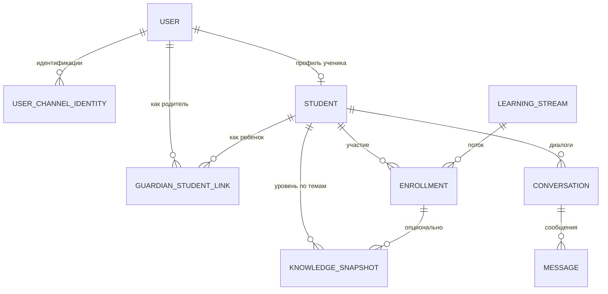
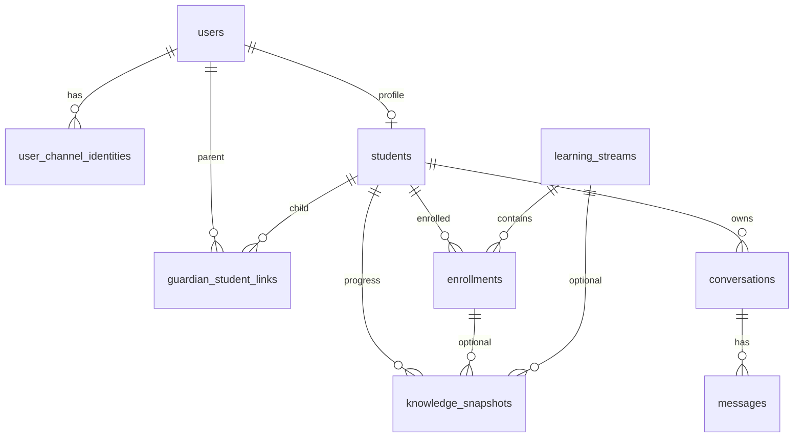

# Модель данных: сопровождение учебного потока

Документ задаёт **логический** состав сущностей и связей и **физическую** схему таблиц PostgreSQL (итерация 3, задача 02). Источник контекста: [vision.md](vision.md), [idea.md](idea.md). Решения по схеме: [docs/tasks/impl/database/iter-3-data-layer/tasks/task-02-schema-design/plan.md](tasks/impl/database/iter-3-data-layer/tasks/task-02-schema-design/plan.md).

---

## Основные сущности (логическая модель)

Минимальный набор: **учётка → идентификаторы по каналам → ученик → поток → диалоги → фиксация уровня**; для сценариев родителя — **связь родитель–ребёнок** (M:N) и жизненный цикл приглашения.

### Пользователь (`User`)

**Назначение:** учётная запись в системе; к одному пользователю привязаны **одна или несколько** пар «канал + внешний id» ([`user_channel_identities`](#физическая-схема-postgresql)).

| Поле / группа | Смысл | Тип данных (ориентир) |
|---|---|---|
| внутренний идентификатор | суррогатный PK | целое (`BIGINT`) |
| контакт (email и т.п.) | опционально, для веба | строка, nullable |
| создан / обновлён | аудит | timestamp |

Внешние идентификаторы (Telegram, web) хранятся не в `User`, а в **`UserChannelIdentity`** (уникальность пары канал + внешний id).

### Идентификация по каналу (`UserChannelIdentity`)

**Назначение:** связать учётку с `X-Channel` и `X-External-User-Id` из API.

| Поле / группа | Смысл | Тип данных |
|---|---|---|
| пользователь | FK на `User` | FK |
| канал | `telegram` / `web` | enum / текст |
| внешний id | строка в канале | текст; **UNIQUE** вместе с каналом |

### Профиль ученика (`Student`)

**Назначение:** обучающийся как субъект прогресса и диалогов; у одного `User` не более **одного** профиля ученика (1:1).

| Поле / группа | Смысл | Тип данных |
|---|---|---|
| ссылка на пользователя | FK на `User` | FK, уникально |
| отображаемое имя | как обращаться в диалоге | строка |
| класс / возрастная группа | опционально | строка, nullable |

### Связь родитель–ребёнок (`GuardianStudentLink`)

**Назначение:** M:N между учёткой родителя (`User` как `parent`) и профилем **`Student`**; статусы приглашения и доступа (см. [задачу 01](tasks/impl/database/iter-3-data-layer/tasks/task-01-user-scenarios/plan.md)).

| Поле / группа | Смысл | Тип данных |
|---|---|---|
| родитель | FK на `User` | FK |
| ученик | FK на `Student` | FK |
| статус | ожидает / активна / отклонена / отозвана / истекло | enum / текст + ограничение |
| приглашение | хэш токена, срок действия | опционально для цикла pending |
| аудит | создано, обновлено | timestamp |

Повторное приглашение после отказа или отзыва — **новая запись** (история попыток).

### Учебный поток (`LearningStream`)

**Назначение:** логическая «линия» обучения (курс, группа репетитора, программа). Для MVP может быть один поток по умолчанию.

| Поле / группа | Смысл | Тип данных |
|---|---|---|
| название | человекочитаемое имя потока | строка |
| описание | кратко | текст, nullable |
| активен | можно ли набирать | boolean |

### Участие в потоке (`Enrollment`)

**Назначение:** связь «ученик учится в этом потоке»; точка отсчёта для отчётов и прогресса.

| Поле / группа | Смысл | Тип данных |
|---|---|---|
| ученик | FK на `Student` | FK |
| поток | FK на `LearningStream` | FK |
| статус | активен / завершён / пауза | enum |
| даты начала / окончания | границы участия | date или timestamp |

### Диалог (`Conversation`)

**Назначение:** сессия общения с репетитором (одна цепочка сообщений для LLM). Разделяет «разные разговоры» во времени.

| Поле / группа | Смысл | Тип данных |
|---|---|---|
| ученик | привязка к `Student` | FK |
| канал | telegram / web | enum |
| начало / последняя активность | для списков и архива | timestamp |
| опционально: тема / контекст | текущая тема урока | строка, nullable |

Публичный идентификатор в API — **UUID** (совпадает с PK в БД).

### Сообщение (`Message`)

**Назначение:** одна реплика в диалоге; хранит историю для восстановления контекста и анализа.

| Поле / группа | Смысл | Тип данных |
|---|---|---|
| диалог | FK на `Conversation` | FK |
| роль | пользователь / ассистент / система | enum |
| текст | содержимое | текст |
| порядок | номер в цепочке | целое |
| служебные метаданные | id модели, токены — по необходимости | JSONB, nullable |

Публичный идентификатор в API — **UUID**.

### Снимок уровня знаний (`KnowledgeSnapshot`)

**Назначение:** фиксация оценки «что усвоено» по теме или навыку; агрегат для прогресса и показа родителю.

| Поле / группа | Смысл | Тип данных |
|---|---|---|
| ученик | FK на `Student` | FK |
| поток | опционально FK на `Enrollment` или `LearningStream` | FK, nullable |
| тема / метка области | идентификатор темы | строка |
| уровень / оценка | качественная шкала | enum / текст |
| краткий комментарий | вывод репетитора или авто-резюме | текст, nullable |
| актуальность | когда зафиксировано | timestamp |

Публичный идентификатор в API — **UUID**.

---

## Связи между сущностями (логическая модель)

- Один **User** может иметь несколько **UserChannelIdentity** (разные каналы).
- Один **User** — не более одного **Student** (профиль ученика).
- **User** (как родитель) связан с **Student** через **GuardianStudentLink** (M:N).
- **Student** участвует в **LearningStream** через **Enrollment**.
- **Conversation** принадлежит **Student**.
- **Message** принадлежит **Conversation** (1:N).
- **KnowledgeSnapshot** привязан к **Student**; опционально — к **Enrollment** / **LearningStream**.

---

## Физическая схема (PostgreSQL)

Имена таблиц и колонок — **`snake_case`**. Типы ориентированы на PostgreSQL; перечисления в MVP — **`TEXT`** + **`CHECK`** (переносимость и простота миграций).

### `users`

| Колонка | Тип | Ограничения |
|---------|-----|-------------|
| `id` | `BIGINT` | `PRIMARY KEY`, `GENERATED ALWAYS AS IDENTITY` |
| `email` | `TEXT` | nullable |
| `created_at` | `TIMESTAMPTZ` | `NOT NULL`, default `now()` |
| `updated_at` | `TIMESTAMPTZ` | `NOT NULL`, default `now()` |

### `user_channel_identities`

| Колонка | Тип | Ограничения |
|---------|-----|-------------|
| `id` | `BIGINT` | `PRIMARY KEY`, `GENERATED ALWAYS AS IDENTITY` |
| `user_id` | `BIGINT` | `NOT NULL`, `REFERENCES users(id) ON DELETE CASCADE` |
| `channel` | `TEXT` | `NOT NULL`, `CHECK (channel IN ('telegram', 'web'))` |
| `external_user_id` | `TEXT` | `NOT NULL` |
| `created_at` | `TIMESTAMPTZ` | `NOT NULL`, default `now()` |

**Уникальность:** `UNIQUE (channel, external_user_id)`.

### `students`

| Колонка | Тип | Ограничения |
|---------|-----|-------------|
| `id` | `BIGINT` | `PRIMARY KEY`, `GENERATED ALWAYS AS IDENTITY` |
| `user_id` | `BIGINT` | `NOT NULL`, `UNIQUE`, `REFERENCES users(id) ON DELETE RESTRICT` |
| `display_name` | `TEXT` | `NOT NULL` |
| `grade_or_age_band` | `TEXT` | nullable |
| `created_at` | `TIMESTAMPTZ` | `NOT NULL`, default `now()` |
| `updated_at` | `TIMESTAMPTZ` | `NOT NULL`, default `now()` |

### `guardian_student_links`

| Колонка | Тип | Ограничения |
|---------|-----|-------------|
| `id` | `BIGINT` | `PRIMARY KEY`, `GENERATED ALWAYS AS IDENTITY` |
| `parent_user_id` | `BIGINT` | `NOT NULL`, `REFERENCES users(id) ON DELETE CASCADE` |
| `student_id` | `BIGINT` | `NOT NULL`, `REFERENCES students(id) ON DELETE CASCADE` |
| `status` | `TEXT` | `NOT NULL`, `CHECK (status IN ('pending', 'active', 'rejected', 'revoked', 'expired'))` |
| `invite_token_hash` | `TEXT` | nullable; `UNIQUE` среди не-NULL (частичный уникальный индекс в PostgreSQL) |
| `expires_at` | `TIMESTAMPTZ` | nullable |
| `created_at` | `TIMESTAMPTZ` | `NOT NULL`, default `now()` |
| `updated_at` | `TIMESTAMPTZ` | `NOT NULL`, default `now()` |

**Частичные уникальные ограничения (PostgreSQL):**

- не более одной **активной** связи на пару: `UNIQUE (parent_user_id, student_id) WHERE status = 'active'`;
- не более одной **ожидающей** на пару: `UNIQUE (parent_user_id, student_id) WHERE status = 'pending'`.

### `learning_streams`

| Колонка | Тип | Ограничения |
|---------|-----|-------------|
| `id` | `UUID` | `PRIMARY KEY`, default `gen_random_uuid()` |
| `name` | `TEXT` | `NOT NULL` |
| `description` | `TEXT` | nullable |
| `is_active` | `BOOLEAN` | `NOT NULL`, default `true` |
| `created_at` | `TIMESTAMPTZ` | `NOT NULL`, default `now()` |
| `updated_at` | `TIMESTAMPTZ` | `NOT NULL`, default `now()` |

### `enrollments`

| Колонка | Тип | Ограничения |
|---------|-----|-------------|
| `id` | `UUID` | `PRIMARY KEY`, default `gen_random_uuid()` |
| `student_id` | `BIGINT` | `NOT NULL`, `REFERENCES students(id) ON DELETE CASCADE` |
| `learning_stream_id` | `UUID` | `NOT NULL`, `REFERENCES learning_streams(id) ON DELETE RESTRICT` |
| `status` | `TEXT` | `NOT NULL`, `CHECK (status IN ('active', 'completed', 'paused'))` |
| `started_at` | `TIMESTAMPTZ` | nullable |
| `ended_at` | `TIMESTAMPTZ` | nullable |
| `created_at` | `TIMESTAMPTZ` | `NOT NULL`, default `now()` |
| `updated_at` | `TIMESTAMPTZ` | `NOT NULL`, default `now()` |

### `conversations`

| Колонка | Тип | Ограничения |
|---------|-----|-------------|
| `id` | `UUID` | `PRIMARY KEY`, default `gen_random_uuid()` |
| `student_id` | `BIGINT` | `NOT NULL`, `REFERENCES students(id) ON DELETE CASCADE` |
| `channel` | `TEXT` | `NOT NULL`, `CHECK (channel IN ('telegram', 'web'))` |
| `topic` | `TEXT` | nullable |
| `created_at` | `TIMESTAMPTZ` | `NOT NULL`, default `now()` |
| `updated_at` | `TIMESTAMPTZ` | `NOT NULL`, default `now()` |

### `messages`

| Колонка | Тип | Ограничения |
|---------|-----|-------------|
| `id` | `UUID` | `PRIMARY KEY`, default `gen_random_uuid()` |
| `conversation_id` | `UUID` | `NOT NULL`, `REFERENCES conversations(id) ON DELETE CASCADE` |
| `role` | `TEXT` | `NOT NULL`, `CHECK (role IN ('user', 'assistant', 'system'))` |
| `content` | `TEXT` | `NOT NULL` |
| `sequence` | `INTEGER` | `NOT NULL`, `CHECK (sequence >= 0)` |
| `metadata` | `JSONB` | nullable |
| `created_at` | `TIMESTAMPTZ` | `NOT NULL`, default `now()` |

**Уникальность порядка в диалоге:** `UNIQUE (conversation_id, sequence)`.

### `knowledge_snapshots`

| Колонка | Тип | Ограничения |
|---------|-----|-------------|
| `id` | `UUID` | `PRIMARY KEY`, default `gen_random_uuid()` |
| `student_id` | `BIGINT` | `NOT NULL`, `REFERENCES students(id) ON DELETE CASCADE` |
| `enrollment_id` | `UUID` | nullable, `REFERENCES enrollments(id) ON DELETE SET NULL` |
| `learning_stream_id` | `UUID` | nullable, `REFERENCES learning_streams(id) ON DELETE SET NULL` |
| `topic` | `TEXT` | `NOT NULL` |
| `level` | `TEXT` | `NOT NULL`, `CHECK (level IN ('needs_work', 'developing', 'proficient', 'mastered'))` |
| `comment` | `TEXT` | nullable |
| `source` | `TEXT` | `NOT NULL`, `CHECK (source IN ('homework', 'self_report', 'tutor'))`, default `'homework'` |
| `recorded_at` | `TIMESTAMPTZ` | `NOT NULL`, default `now()` |
| `created_at` | `TIMESTAMPTZ` | `NOT NULL`, default `now()` |

---

## Индексы (физическая модель)

Рекомендуемые индексы (FK в PostgreSQL **не** индексируются автоматически):

| Таблица | Индекс | Назначение |
|---------|--------|------------|
| `user_channel_identities` | `(user_id)` | выбор идентичностей пользователя |
| `guardian_student_links` | `(parent_user_id)` | список детей родителя |
| `guardian_student_links` | `(student_id)` | список родителей ученика |
| `guardian_student_links` | `UNIQUE (parent_user_id, student_id) WHERE status = 'active'` | одна активная связь на пару |
| `guardian_student_links` | `UNIQUE (parent_user_id, student_id) WHERE status = 'pending'` | одно ожидающее приглашение на пару |
| `guardian_student_links` | `UNIQUE (invite_token_hash) WHERE invite_token_hash IS NOT NULL` | уникальность токена и поиск по приглашению |
| `enrollments` | `(student_id)` | участия ученика |
| `enrollments` | `(learning_stream_id)` | FK |
| `conversations` | `(student_id, updated_at DESC)` | список диалогов ученика по активности |
| `messages` | `(conversation_id)` | сообщения диалога |
| `knowledge_snapshots` | `(student_id, recorded_at DESC)` | прогресс по времени |
| `knowledge_snapshots` | `(enrollment_id)` | nullable FK |
| `knowledge_snapshots` | `(learning_stream_id)` | nullable FK |

Частичные уникальные индексы для `guardian_student_links` — см. раздел таблицы.

### Аудит по postgresql-table-design

| Критерий (skill) | Статус |
|------------------|--------|
| PK: `BIGINT GENERATED ALWAYS AS IDENTITY` для суррогатов; `UUID` где нужна непрозрачность / публичный id API | Соответствует |
| `TIMESTAMPTZ`, `TEXT`, без `timestamp` без TZ, без `varchar(n)`/`char(n)` для строк | Соответствует |
| Индексы на столбцах **FK** (в PG не создаются автоматически) | Заданы в таблице индексов |
| `NOT NULL` / `DEFAULT` для обязательных полей; перечисления через `TEXT` + `CHECK` для эволюции статусов | Соответствует |
| Нормализация; **JSONB** только для опциональных метаданных сообщения, без обязательных индексов GIN «на будущее» | Соответствует |
| FK с явным **`ON DELETE`** | Задано; **`ON UPDATE`** не требуется при неизменяемых PK |

**Замечания некритичные (улучшения по желанию):**

1. **`enrollments`:** при бизнес-правиле «не больше одного активного участия ученика в одном потоке» — частичный уникальный индекс `UNIQUE (student_id, learning_stream_id) WHERE status = 'active'`.
2. **`messages.sequence`:** в skill предпочтительнее **`BIGINT`** для целых; `INTEGER` допустим, если диалоги ограничены по длине.
3. **`knowledge_snapshots`:** одновременно `enrollment_id` и `learning_stream_id` могут дублировать смысл (поток выводится из enrollment); оставлено для гибкости API — при реализации стоит зафиксировать правило заполнения или проверку согласованности.
4. **GIN по `messages.metadata`:** добавлять при появлении реальных запросов по JSONB (skill: индексировать пути доступа).

---

## Физическая ER-диаграмма (таблицы)

---

## Переносимость PostgreSQL и SQLite

- **Продакшен и целевая разработка** — **PostgreSQL** ([ADR-001](adr/adr-001-database.md)); локальный запуск через Docker и `make db-up` — в задаче «Инфраструктура БД».
- Схема выше использует **`TIMESTAMPTZ`**, **`JSONB`**, **`gen_random_uuid()`**, **частичные уникальные индексы** — нативно в PostgreSQL.
- Отдельная ветка миграций под SQLite (упрощение JSONB, UUID как TEXT, частичных индексов) **не обязательна**, пока dev ориентирован на PostgreSQL; при необходимости раннего SQLite — типы и ограничения ужимаются в миграциях осознанно ([ADR-001](adr/adr-001-database.md)).

---

## Соответствие полей HTTP API v1

Публичный контракт — [backend/openapi.yaml](../backend/openapi.yaml) (путь `/api/v1`). Идентификация: заголовки `X-Channel` и `X-External-User-Id` → строка в `user_channel_identities` → `users` → `students`.

**MVP (итерация 2):** в процессе backend сущности могли храниться в памяти; после внедрения БД идентификаторы ресурсов в API сохраняют формат ниже.

| Сущность | Поля в API v1 | Соответствие в БД |
|----------|----------------|-------------------|
| `Conversation` | `id` (UUID), `channel`, `external_user_id`, `topic`, `created_at`, `updated_at` | `conversations.id`, `channel`; `external_user_id` — из join с `user_channel_identities` / контекста ученика; `topic`, `created_at`, `updated_at` |
| `Message` | `id`, `conversation_id`, `role`, `content`, `sequence`, `created_at` | `messages.*` |
| `KnowledgeSnapshot` | `id`, `channel`, `external_user_id`, `topic`, `level`, `comment`, `enrollment_id`, `learning_stream_id`, `source`, `recorded_at` | `knowledge_snapshots.*`; канал и внешний id — через `students` → `users` → идентичность |
| `Enrollment` / поток (в теле снимка) | UUID в JSON | `enrollments.id`, `learning_streams.id` |

Уровень (`level`) и `source` в БД хранятся как те же строковые значения, что и в OpenAPI.

---

## Выбор СУБД

Полное обоснование — **[ADR-001: выбор СУБД](adr/adr-001-database.md)**.

Кратко: целевая СУБД — **PostgreSQL**; **SQLite** допустим для раннего MVP только при осознанно переносимых миграциях; логическая модель реляционна в обоих случаях.
