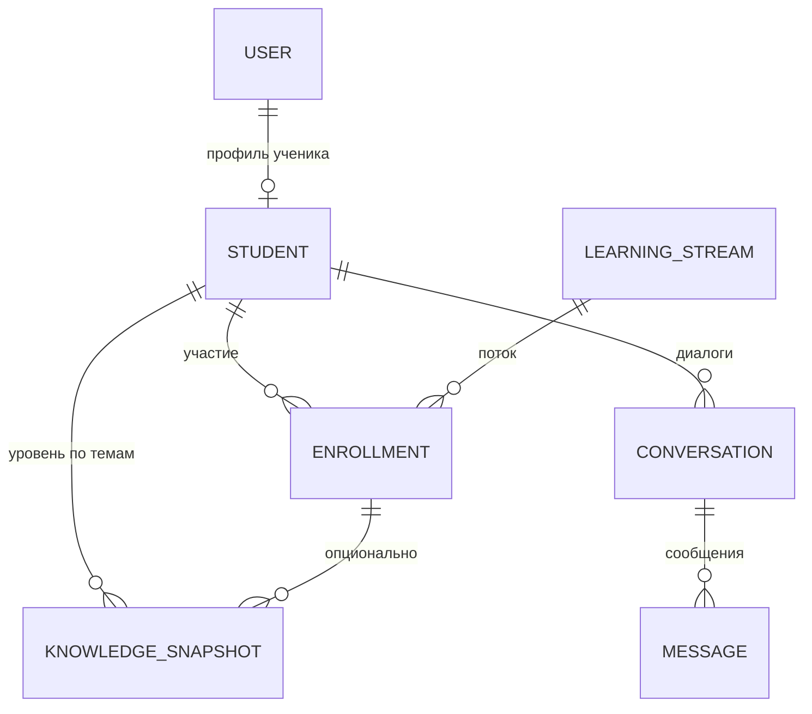

# Модель данных: сопровождение учебного потока

Документ задаёт базовый состав сущностей и связей. Детализация схемы таблиц — по мере внедрения БД. Источник контекста: [vision.md](vision.md), [idea.md](idea.md).

---

## Основные сущности

Минимальный набор: **учётка → ученик → поток → диалоги → фиксация уровня**. Без лишних связей и справочников на старте.

### Пользователь (`User`)

**Назначение:** учётная запись в системе; привязка к внешним каналам (Telegram, позже — веб).

| Поле / группа | Смысл | Тип данных (ориентир) |
|---|---|---|
| внутренний идентификатор | первичный ключ | UUID или целое |
| внешний id Telegram | связь с ботом | строка / bigint |
| контакт (email и т.п.) | опционально, для веба | строка, nullable |
| роли | ученик / родитель / … | перечисление или отдельная таблица позже |
| создан / обновлён | аудит | timestamp |

### Профиль ученика (`Student`)

**Назначение:** обучающийся как субъект прогресса и диалогов (один пользователь может иметь профиль ученика).

| Поле / группа | Смысл | Тип данных |
|---|---|---|
| ссылка на пользователя | 1:1 или 1:0..1 с `User` | FK |
| отображаемое имя | как обращаться в диалоге | строка |
| класс / возрастная группа | опционально, для подстройки тона | строка или enum, nullable |

### Учебный поток (`LearningStream`)

**Назначение:** логическая «линия» обучения (курс, группа репетитора, программа). Для MVP может быть один поток по умолчанию.

| Поле / группа | Смысл | Тип данных |
|---|---|---|
| название | человекочитаемое имя потока | строка |
| описание | кратко | текст, nullable |
| активен | можно ли набирать | boolean |

### Участие в потоке (`Enrollment`)

**Назначение:** связь «ученик учится в этом потоке»; точка отсчёта для отчётов и прогресса.

| Поле / группа | Смысл | Тип данных |
|---|---|---|
| ученик | FK на `Student` | FK |
| поток | FK на `LearningStream` | FK |
| статус | активен / завершён / пауза | enum |
| даты начала / окончания | границы участия | date или timestamp |

### Диалог (`Conversation`)

**Назначение:** сессия общения с репетитором (одна цепочка сообщений для LLM). Разделяет «разные разговоры» во времени.

| Поле / группа | Смысл | Тип данных |
|---|---|---|
| ученик или участие | привязка к `Student` или `Enrollment` | FK (на MVP достаточно `Student`) |
| канал | telegram / web | enum |
| начало / последняя активность | для списков и архива | timestamp |
| опционально: тема / контекст | текущая тема урока | строка, nullable |

### Сообщение (`Message`)

**Назначение:** одна реплика в диалоге; хранит историю для восстановления контекста и анализа.

| Поле / группа | Смысл | Тип данных |
|---|---|---|
| диалог | FK на `Conversation` | FK |
| роль | пользователь / ассистент / система | enum |
| текст | содержимое | текст |
| порядок | номер в цепочке | целое |
| служебные метаданные | id модели, токены — по необходимости | JSON или отдельные поля |

### Снимок уровня знаний (`KnowledgeSnapshot`)

**Назначение:** фиксация оценки «что усвоено» по теме или навыку; не черновик диалога, а агрегат для прогресса и показа родителю.

| Поле / группа | Смысл | Тип данных |
|---|---|---|
| ученик | FK на `Student` | FK |
| поток | опционально FK на `Enrollment` или `LearningStream` | FK, nullable |
| тема / метка области | идентификатор темы (строка или FK на `Topic` позже) | строка |
| уровень / оценка | качественная или числовая шкала | enum или decimal |
| краткий комментарий | вывод репетитора или авто-резюме | текст, nullable |
| актуальность | когда зафиксировано | timestamp |

---

## Связи между сущностями

- Один **User** может иметь один **Student** (расширение: несколько ролей — отдельным этапом).
- **Student** участвует в **LearningStream** через **Enrollment** (многие ко многим через enrollment).
- **Conversation** принадлежит **Student** (и при необходимости уточняется потоком через `Enrollment`).
- **Message** принадлежит **Conversation** (1:N).
- **KnowledgeSnapshot** привязан к **Student**; опционально — к участию в потоке для отчётности «в рамках курса».

---

## Соответствие полей HTTP API v1

Публичный контракт — [backend/openapi.yaml](../backend/openapi.yaml) (путь `/api/v1`). Ниже — сопоставление сущностей этого документа с полями API без изменения логической модели выше.

**MVP (итерация 2):** сущности `Conversation`, `Message` и `KnowledgeSnapshot` на стороне backend хранятся **в памяти процесса** (без БД); после внедрения персистентности (итерация 3) логические поля и связи ниже сохраняют смысл для таблиц и миграций.

Идентификация ученика на границе API (MVP, без отдельного ресурса `User` в URL): заголовки `X-Channel` (`telegram` \| `web`) и `X-External-User-Id` (строка; для Telegram — id пользователя в Telegram).

| Сущность | Поля / смысл в data-model | Поля в API v1 |
|----------|---------------------------|---------------|
| `Conversation` | ученик, канал, тема, время | `id`, `channel`, `external_user_id`, `topic`, `created_at`, `updated_at` |
| `Message` | диалог, роль, текст, порядок | `id`, `conversation_id`, `role` (`user` \| `assistant` \| `system`), `content`, `sequence`, `created_at` |
| `KnowledgeSnapshot` | ученик, поток/участие, тема, уровень, комментарий, время | `id`, `channel`, `external_user_id`, `topic`, `level` (enum `needs_work` … `mastered`), `comment`, `enrollment_id`, `learning_stream_id`, `source` (`homework` \| …), `recorded_at` |

Уровень в API v1 задан перечислением качественных значений; при появлении БД допускается хранить то же значение или отдельная таблица шкал.

---

## Выбор СУБД

Полное обоснование, альтернативы и последствия — в **[ADR-001: выбор СУБД](adr/adr-001-database.md)**.

Кратко: целевая СУБД проекта — **PostgreSQL**; **SQLite** допустим для dev и раннего MVP при переносимых миграциях. Логическая модель выше остаётся реляционной в обоих случаях.
