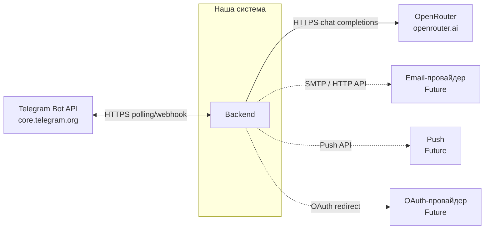

# Внешние интеграции

Сводка по системам вне периметра нашего backend. Контекст продукта: [idea.md](idea.md), архитектура: [vision.md](vision.md).

---

## Внешние системы

| Система | Ссылка | Назначение в продукте | Направление | Протокол / способ | Критичность |
|---|---|---|---|---|---|
| **Telegram Bot API** | [core.telegram.org/bots/api](https://core.telegram.org/bots/api) | Доставка сообщений ученику и приём ответов в боте | **Bidirectional** | HTTPS, long polling или webhook; клиентская библиотека (aiogram) | **MVP** |
| **OpenRouter** | [openrouter.ai](https://openrouter.ai) | Доступ к LLM для объяснений, заданий и проверки ответов | **Out** (запросы наружу) | HTTPS, OpenAI-совместимый API | **MVP** |
| **Почтовый / транзакционный провайдер** | (выбор позже: SMTP, SendGrid, Resend и т.п.) | Уведомления родителю, восстановление доступа к веб-кабинету | **Out** | SMTP или HTTP API провайдера | **Future** |
| **Провайдер push** | (FCM, APNs, Web Push — по платформе) | Напоминания и алерты на устройство | **Out** | SDK / HTTP API платформы | **Future** |
| **OAuth / OpenID-провайдер** | (Google, Apple, и др. — по выбору) | Вход в веб-приложение без отдельной парольной базы | **Bidirectional** (редирект + callback) | OAuth 2.0 / OIDC по HTTPS | **Future** |

---

## Схема взаимодействий

Легенда: сплошная линия — **MVP**; пунктир — **Future**.

---

## Зависимости и риски

**Критично для MVP:** Telegram и OpenRouter. Без Telegram нет основного канала ученика; без LLM нет смысла репетитора. Оба — внешние SaaS: доступность и лимиты определяются провайдерами.

**Риски и внимание:**
- **Telegram:** лимиты Bot API, блокировки/политики мессенджера, необходимость хранить токен бота в секретах; при webhook — публичный HTTPS и корректная верификация.
- **OpenRouter:** зависимость от выбранной модели, квоты, стоимость запросов; смена модели может требовать подстройки промптов (не интеграционный, но продуктовый риск).
- **Future-интеграции:** доставляемость писем (спам-фильтры), согласие на рассылку; для OAuth — регистрация приложения у провайдера и хранение client secret.

Резервирование: при отказе одного LLM-провайдера архитектурно заложен OpenAI-совместимый клиент — миграция на другой endpoint без смены доменной модели ([vision.md](vision.md)).

**Backend и OpenRouter:** в целевой схеме клиенты (бот, веб) обращаются к **backend**; вызовы к OpenRouter выполняет **backend** с использованием `OPENROUTER_API_KEY` и связанных переменных из `.env`. Ключ и прочие секреты не должны попадать в логи ([vision.md](vision.md) — конфигурация и логирование).
