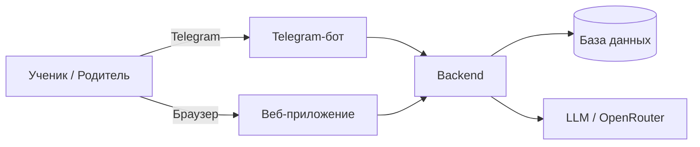
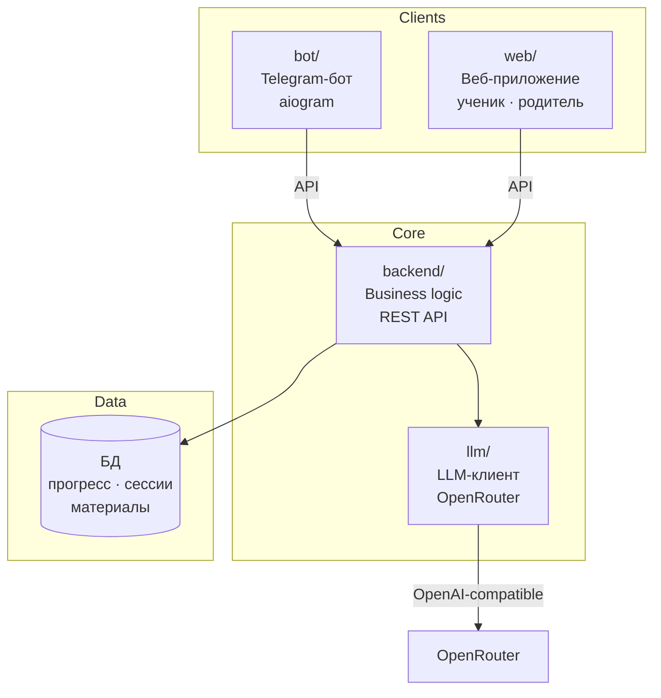
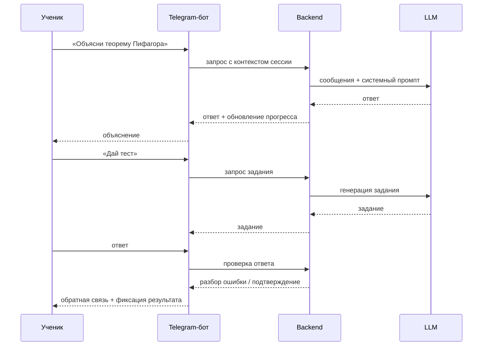

# Vision: AI-репетитор — система сопровождения обучения

## Назначение документа

Техническое и архитектурное видение продукта. Источник правды для принятия решений по структуре системы, компонентам и технологическому стеку.

Продуктовый контекст — в [idea.md](idea.md).

---

## Границы системы

Продукт — это **система сопровождения учебного процесса**, а не отдельный Telegram-бот.

Telegram-бот — первый клиент системы. В дальнейшем к единому backend подключается веб-приложение. Оба клиента работают с одними и теми же данными через одно ядро.



---

## Архитектурные принципы

- **Ядро системы — backend.** Бот и веб-интерфейс — клиенты; вся логика централизована.
- **KISS** — минимальная сложность на каждом уровне.
- **Явный конфиг** — все настройки через `.env`; хардкод запрещён.
- **Stateless LLM-клиент** — история диалога хранится в слое данных, а не в клиенте.
- **Один нетривиальный класс — один модуль.**
- **MVP без персистентной БД** — состояние в памяти; БД добавляется по мере роста.

---

## Архитектурные решения

Зафиксированные решения хранятся в [docs/adr/](adr/README.md). Первое принятое решение — выбор СУБД: [ADR-001: база данных](adr/adr-001-database.md) (PostgreSQL как целевая; SQLite — для dev/раннего MVP при переносимых миграциях).

---

## Компоненты системы



### Telegram-бот (`bot/`)
- Клиент backend, не самостоятельное приложение.
- Принимает сообщения от ученика, отправляет запросы в backend, возвращает ответ.
- Режим работы: polling (MVP) → webhook (продакшн).

### Веб-приложение (`web/`)
- Единый frontend-проект с разграничением по ролям.
- **Роль ученика:** прохождение заданий, просмотр прогресса, история занятий.
- **Роль родителя:** активность ученика, результаты, динамика.
- В перспективе: **роль преподавателя** — ведение группы, назначение материалов.

### Backend (`backend/`)
- Единое ядро системы. Хранит и обрабатывает весь учебный контекст.
- Отвечает за: сессии учеников, прогресс, материалы, задания, результаты, LLM-взаимодействие.
- Предоставляет API для бота и веб-приложения.

### LLM-компонент
- Stateless-клиент над OpenRouter.
- Принимает готовый массив сообщений, возвращает текст ответа.
- Модель и провайдер задаются в конфигурации.

### Слой данных
- MVP: состояние в памяти (`user_id → session`).
- Персистенция: см. [ADR-001](adr/adr-001-database.md); логическая модель — [data-model.md](data-model.md).

---

## Роли и сценарии

| Роль | Интерфейс | Сценарии |
|---|---|---|
| Ученик | Бот, Веб | Получить объяснение, пройти тест, сдать домашнее задание, посмотреть прогресс |
| Родитель | Веб | Просмотреть активность ребёнка, увидеть результаты и пробелы |
| Преподаватель | Веб (в перспективе) | Вести учеников, назначать материалы, видеть динамику группы |

**Ключевые сценарии MVP:**



---

## Доменные сущности

> Детальная схема — в [data-model.md](data-model.md).

| Сущность | Описание |
|---|---|
| Пользователь | Учётная запись; может выступать в роли ученика или родителя |
| Ученик | Пользователь, проходящий обучение |
| Поток / группа | Набор учеников, объединённых программой |
| Модуль | Раздел учебной программы (тема или блок тем) |
| Занятие | Конкретная учебная сессия; имеет статус и итог |
| Материал | Объяснительный контент по теме |
| Задание | Вопрос или упражнение для ученика |
| Результат (submission) | Ответ ученика на задание + оценка системы |
| Прогресс | Агрегированное состояние по модулям и заданиям |
| FAQ / Knowledge item | База знаний репетитора (промпты, подсказки, типовые ошибки) |

---

## Внешние связи

> Детали — в [integrations.md](integrations.md).

| Система | Назначение |
|---|---|
| Telegram Bot API | Приём и отправка сообщений через бота |
| OpenRouter | Унифицированный доступ к LLM-моделям |
| (в перспективе) Email / Push | Уведомления для родителей |
| (в перспективе) OAuth | Авторизация в веб-приложении |

---

## Структура репозитория

```
olich_tutor/
├── bot/                    # Telegram-бот (клиент)
│   ├── handlers/           # Обработчики сообщений aiogram
│   └── keyboards/          # Inline- и reply-клавиатуры
├── backend/                # Ядро системы
│   ├── api/                # Точки входа (роутеры)
│   ├── services/           # Бизнес-логика
│   ├── llm/                # LLM-клиент (OpenRouter)
│   └── tutor/              # Сессия и прогресс ученика
├── web/                    # Веб-приложение (клиент)
│   └── ...                 # Детали — после начала разработки
├── docs/
│   ├── idea.md             # Продуктовый контекст
│   ├── vision.md           # Этот документ
│   ├── data-model.md       # Доменная модель
│   ├── adr/                # Архитектурные решения (ADR)
│   └── integrations.md     # Внешние интеграции
├── config.py               # Settings — загрузка переменных окружения
├── main.py                 # Точка входа MVP (запуск бота)
├── .env.example
├── .env
├── Makefile
└── requirements.txt
```

> Текущий MVP — монорепо с ботом как точкой входа. По мере роста компоненты выделяются в независимые сервисы.

---

## Технологический стек

### Общее

| Область | Решение |
|---|---|
| Язык | Python 3.12+ |
| Окружение | `venv` + `uv` |
| Конфиг | `pydantic-settings` + `.env` |
| Линтер / форматтер | `ruff` |

### Bot

| Пакет | Назначение |
|---|---|
| `aiogram` | Telegram Bot API, polling/webhook |

### Backend / LLM

| Пакет | Назначение |
|---|---|
| `openai` | OpenAI-совместимый клиент для OpenRouter |
| `python-dotenv` | Поддержка `.env` |

### Web (в перспективе)

Стек уточняется. Ориентир: лёгкий SPA (React или аналог) с минимальными зависимостями.

---

## Конфигурация

Файл `.env` (не коммитится):
```
TELEGRAM_TOKEN=...
OPENROUTER_API_KEY=...
OPENROUTER_BASE_URL=https://openrouter.ai/api/v1
LLM_MODEL=openai/gpt-4o-mini
LOG_LEVEL=INFO
```

Файл `.env.example` — шаблон без значений, коммитится в репозиторий.

---

## Логирование

- Стандартный `logging`, настройка в точке входа.
- Уровень задаётся через `LOG_LEVEL`.
- Формат: `%(asctime)s [%(levelname)s] %(name)s: %(message)s`.
- MVP: вывод в stdout.

---

## Make-команды

| Команда | Действие |
|---|---|
| `make install` | Создать venv, установить зависимости |
| `make run` | Запустить бота (MVP) |
| `make lint` | Проверка кода (ruff check) |
| `make format` | Форматирование (ruff format) |

---

## Деплой

MVP — VPS с systemd-сервисом или Docker-контейнером.
Продакшн-стратегия уточняется после выхода за пределы MVP.
